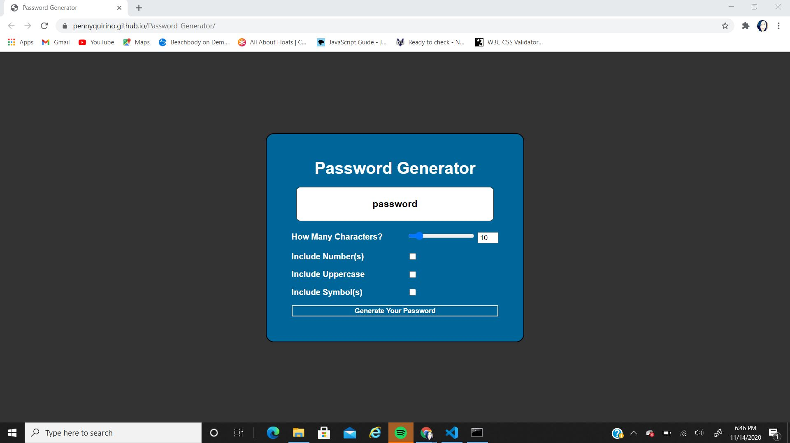

# Password-Generator

<a href="https://pennyquirino.github.io/Password-Generator/">Click to see my work</a> 

This project was to creat an application for a user to generate a random password with minimum character length of 8 characters and no more than 128 characters. 

This application will run in a browser, will feature dynamic HTML and CSS with JavaScript. This must include special characters. 

I made my generator to have the required minimum characters of 8 and I chose a maximum of 25 characters. This was solely based off of thinking real life, rarely does someone have a password above 25 characters. 

I gave it the full alphabet both upper and lower case letters, numbers, and symbols. I went with a slider to make it a little more interactive and it seemed more fun to have as well. 

When boxes are checked, it will generate a password using the boxes checked in addition to the default of lowercase.

The homework should not produce any errors in the console when you inspect it using Chrome DevTools.
Repository has a unique name.
Repository follows best practices for file structure and naming conventions.
Repository follows best practices for class/id naming conventions, indentation, quality comments, etc.
Repository contains multiple descriptive commit messages.
Repository contains quality README file with description, screenshot, and link to deployed application.

